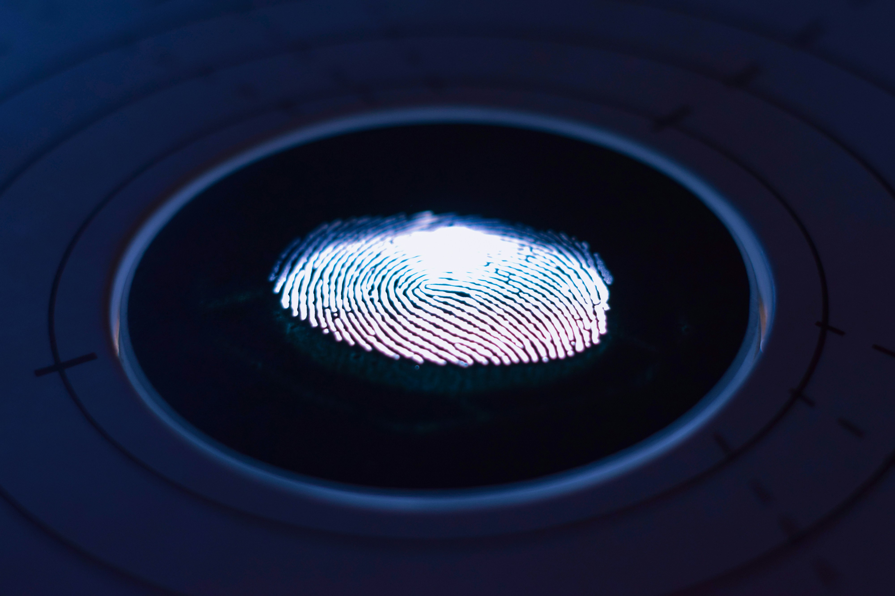
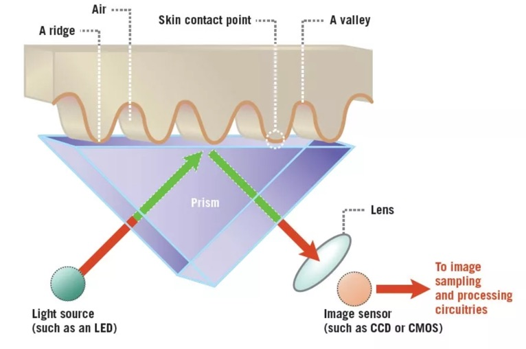
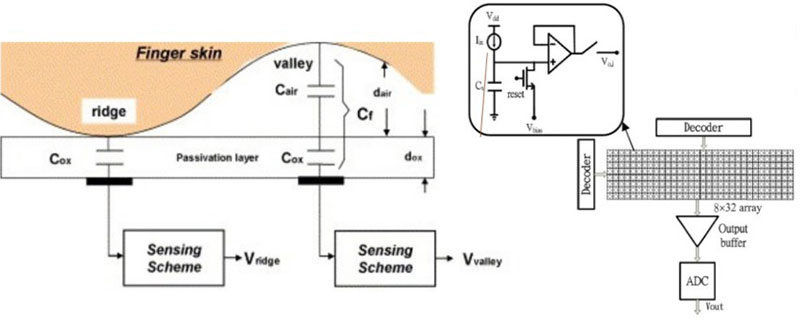

---
date:
    created: 2024-12-29
categories:
    - Opinion
authors:
    - fria
tags:
    - Biometrics
license: BY-SA
---
# Biometrics Explained

Biometrics are a convenient and secure way to authenticate our devices. Many of us use and trust the biometrics of our devices without much thought, but are they really secure? With so many different [options](https://www.biometricsinstitute.org/what-is-biometrics/types-of-biometrics/), which ones are the best?<!-- more -->

## :material-fingerprint: Fingerprint

One of the most recognizable types of biometric authentication has to be the fingerprint reader. The idea is that everyone has a fairly unique fingerprint, so we should be able to distinguish between your fingerprint and someone else's reliably. (1) [Finger minutiae](https://sites.rutgers.edu/fingerprinting/no-two-finger-prints-are-alike/) data is used to identify a fingerprint as unique. This data consists of the points on your fingerprint where lines split, abruptly end, individual dots, etc. Two people can have the same number of arches, loops, and whorls, but they won't have the exact same configuraitons of minutiae.
{ .annotate }

1. :material-fingerprint: It's theorized that the reason humans have fingerprints in the first place is to [enhance our sense of touch](https://www.science.org/doi/10.1126/science.1166467).

<figure markdown>
  
  <figcaption>source: <a href="https://sites.rutgers.edu/fingerprinting/no-two-finger-prints-are-alike/">rutgers.edu</a></figcaption>
</figure>

Using these details for identification gives several advantages over trying to read the whole fingerprint. It allows the device to use less processing power, as well as providing some flexibility in case your finger is smudged or at a strange angle. The sensor doesn't even need to see your whole fingerprint. You might notice some fingerprint readers are very thin and might be located in a convenient place like a power button; finger minutiae is what allows them to still operate securely.

There are [three](https://www.androidauthority.com/how-fingerprint-scanners-work-670934/) main ways we accomplish this in consumer devices: optical sensors, capacitive sensors, and ultrasonic sensors.

### :material-camera: Optical Fingerprint Sensors

An optical sensor works by taking a picture of your fingerprint and turning it into data. They are the cheapest and least secure option. Since optical sensors capture two-dimensional images, an attacker may gain access by simply taking a picture of your fingerprint.

<figure markdown>
  
  <figcaption>source: <a href="https://clockit.io/fingerprint-scanner/">clockit.io</a></figcaption>
</figure>

Many devices implement one of these sensors under the display.

Optical sensors can struggle in the presence of bright sunlight, which is an issue on a mobile device that you take around with you and use wherever you are.

### :material-lightning-bolt: Capacitive Fingerprint Sensors

Capacitive sensors measure the electrical conductivity of your finger. These are much more secure than optical sensors since they can't be fooled with an image. They're also tough to fool with prosthetics as different materials will have different electical properties.

<figure markdown>
  
  <figcaption>source: <a href="https://www.bayometric.com/capacitive-vs-optical/">bayometric.com</a></figcaption>
</figure>

Capacitive sensors won't work if the [tissue is dead](https://www.livescience.com/62393-dead-fingerprint-unlock-phone.html), since dead tissue loses all electrical charge. So morbid worries about someone using your dead body to unlock your phone can be assuaged.

Conveniently they also don't require a light source under them to work, although they will struggle in the presence of moisture.

### :material-volume-high: Ultrasonic Fingerprint Sensors

Ultrasonic fingerprint sensors use sound to create a detailed 3D representation of your fingerprint using ultrasound waves (sound waves with a frequency greater than 20khz). It's a similar concept to what's used to map the ocean floor: sound is emitted from transducers and bounces off your skin. By measuring the time it takes for the sound to reach the microphones, your phone can create a detailed map of the ridges and valleys in your finger.

<figure markdown>
  
  <figcaption>source: <a href="https://www.researchgate.net/publication/285770473_Piezoelectric_Micromachined_Ultrasonic_Transducers_for_Fingerprint_Sensing">Yipeng Lu</a></figcaption>
</figure>

This is the most expensive type of sensor but it produces the most accurate readings with the highest reliability. It doesn't matter if your finger is a bit dirty or wet, it will still work unlike optical or capacitive sensors.

Ultrasonic sensors can't be fooled by 2D images.

One downside is that you lose the protection against dead tissue that capacitive sensors offer, but this is not relevant for most people.

### Additional Considerations

Fingerprint unlock will inherently be vulnerable to someone forcing you to put your finger on the sensor to unlock your device, so keep this in mind when threat modeling.

They also won't work with gloves and sometimes screen protectors can interfere, so make sure that the sensor is uncovered and making direct contact with your actual finger.

Fingerprint authentication will protect you against someone filming you surreptitiously while typing in your password or shoulder surfing. This is an especially relevant attack if your threat model includes thieves as a common attack is watching you type your passcode in and then stealing your phone.

## :material-face-recognition: Face Unlock

Many devices come with the capability to unlock them using your face. The [implementations](https://www.androidauthority.com/face-unlock-smartphones-3043993/) of this technology can vary wildly between manufacturers since a secure implementation requires a lot of special hardware, so many OEMs choose to cheap out. All forms of face unlock are more likely to allow a twin or sibling into your device since their face is more similar to yours than a random person off the street, so keep that in mind in your threat model.

### :material-camera-front: 2D Camera Face Unlock

Every phone already has a camera, so why not use it for face unlock? There are many reasons.

If you're relying on a plain 2D image, then there's always the possibility that it could be fooled by a regular photo. Someone getting in to your phone because they have a picture of your face is a security nightmare scenario and the only thing stopping it is the whims of whatever algorithm was programmed into your phone.

This form of face unlock is also less likely to work in low-light conditions than infrared variants.

### :material-heat-wave: 2D Infrared Face Unlock

The next step up in security is an infrared sensor. This requires dedicated hardware to be built into the device, which eats up space and adds cost. But what you get in return is a form of face unlock that's more reliable in low-light conditions and more resistant to photographs.

### :material-cube-scan: 3D Face Unlock

The potential of this technology truly shines when 2D face unlock is combined with an infrared flood illuminator. These are able to shine thousands of invisible infrared dots on your face and record the distance of each one, creating a 3D map of your face. As you can probably imagine, this tech takes up quite a bit of space and adds yet more cost to the device, as well as likely being the main reason for the "notch" on iPhones. This drawback is well worth it though. According to [Apple](https://support.apple.com/en-us/102381):

>The probability that a random person in the population could look at your iPhone or iPad Pro and unlock it using Face ID is less than 1 in 1,000,000 with a single enrolled appearance whether or not you're wearing a mask.

They put the odds for Touch ID around [1 in 50,000](https://support.apple.com/en-us/105095) for comparison.

3D face unlock is immune to 2D images and requires a 3D reconstruction of a face before it has a chance of being fooled.

### Additional Considerations

You'll likely want an implementation with some protection against another person pointing your phone at your face to unlock it. iOS allows you to enable a setting where you need to be looking at the phone before it will unlock (called "Require Attention for Face ID), look for a similar feature when shopping for a device.

Some devices allow for unlocking with a facemask. This is less secure than without a facemask, so keep that in mind when enabling this setting.

## :material-eye: Iris Sensors

A spy movie classic but newcomer in the consumer electronics field, iris sensors offer authentication via the unique properties of your eyes. The Apple Vision Pro is the most notable example with its [Optic ID](https://support.apple.com/en-us/118483).

It uses near-infrared light to reveal highly unique patterns independent of the pigmentation of your eyes. Apple estimates the liklihood of a random person being able to unlock your Optic ID at less than 1 in 1,000,000, similar to Face ID.

The extremely short distance this technology operates at makes it very difficult for someone to unlock your device without you noticing, and you can simply close your eyes to prevent someone from forcing you to unlock it.

## :material-keyboard: Typing Biometrics

Companies like [TypingDNA](https://www.typingdna.com) claim to be able to identify users by how they type.

The stated usecase is 2FA and continuous authentication for employee devices. Likely you'll only encounter this technology on work devices, especially since this type of biometrics will be affected by the type of keyboard you're using. It only really makes since to authenticate on a specific device that you'll be using continuously and typing on a lot, such as a work laptop.

It could also be used on websites to uniquely identify you, so type in a text editor program then copy/paste into the browser window to avoid this specific type of fingerprinting.

## :material-walk: Gait Biometrics

Possibly the most insidious of the biometric systems in widespread use is gait recognition. Yes, you can be uniquely identified just by how you walk.

### Camera

This technology can work using only 2D footage and doesn't even require close proximity or high resolution sensors like other forms of biometrics. Combined with the huge network of cameras deployed in most cities, you can potentially be identified and tracked around even with a fully covered face.

This type of biometric can work without your consent and when other identifiable features such as face and fingerprints are hidden. It's also very difficult to impersonate someone else's gait.

There are two approaches for extracting biometric data from video.

#### Model-based

This approach attempts to model the human body in order to track the different parts of it. A well-known example of this approach is the Microsoft Kinect, which only consists of a fairly low-resolution camera. It simplifies the human body into a stick figure, which you can see in footage of the [Kinect](https://www.youtube.com/watch?v=33AsuE-WP64) in action. It then uses the distances and joint angles of the model for gait recognition.

#### Model-free

Model-free approaches don't try to model the human body but instead use the whole motion of human silhouettes. This gives a few advantages, namely it works regardless of camera quality and it takes significantly fewer resources.

### Accelerometer

Accelerometers such as those found in your smartphone can also be used for gait recognition.

### Floor Sensor

## :material-chip: Secure Element

All forms of biometric authentication rely on proper hardware such as a secure element in order to be secure. The secure element provides a secure and tamper-resistant place to store your biometric data so it can't be easily extracted. Examples include Apple's [Secure Enclave](https://support.apple.com/guide/security/secure-enclave-sec59b0b31ff/web) and Google's [Titan M](https://security.googleblog.com/2021/10/pixel-6-setting-new-standard-for-mobile.html) series of chips. You should avoid devices that lack a secure element; they won't be able to properly implement secure biometrics without one.

## :material-matrix: Algorithm

Because biometric systems need to translate the physical properties of your body to data, they rely on an algorithm to determine if their reading matches closely enough. 

[Android](https://source.android.com/docs/security/features/biometric) has guidelines on how OEMs should implement biometrics and how they can [test](https://source.android.com/docs/security/features/biometric/measure) them for security. If you're performing your own security research, you should look here for guidance on testing methodology.

There is also independent research into the security of biometric systems. This combination of external and internal rigor helps ensure the security of these systems, although more well known brands like Apple and Google will receive more scrutiny than lesser-known ones.