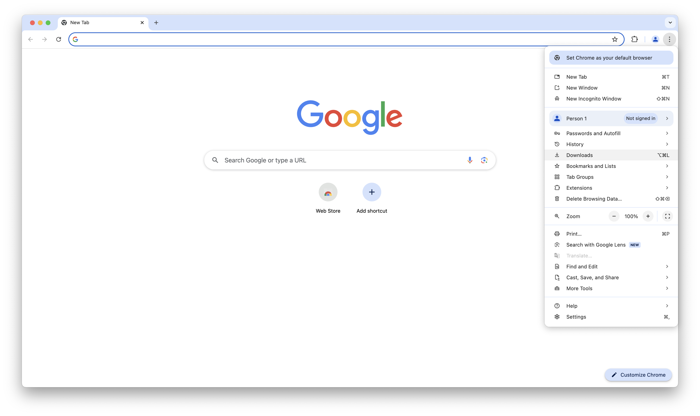
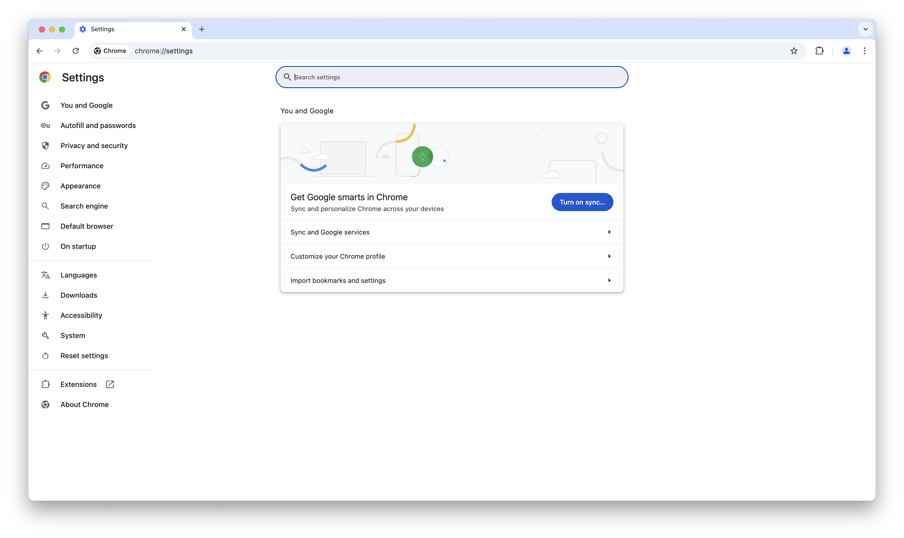
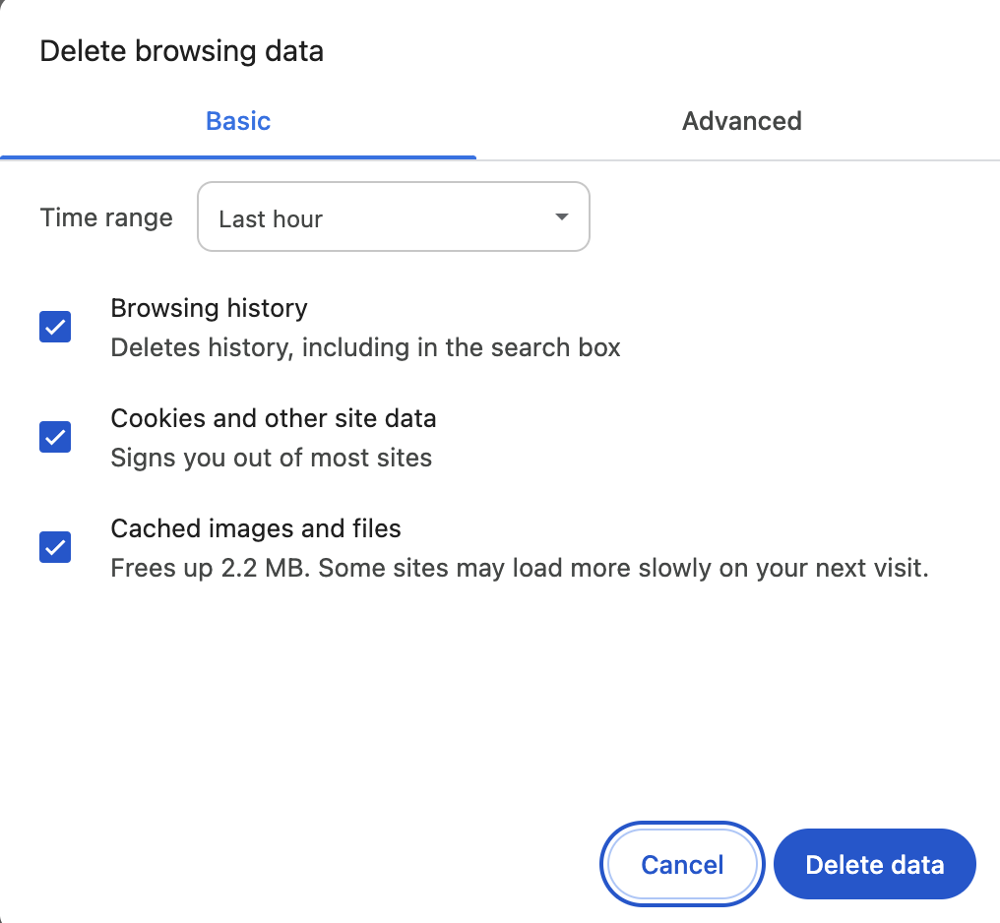
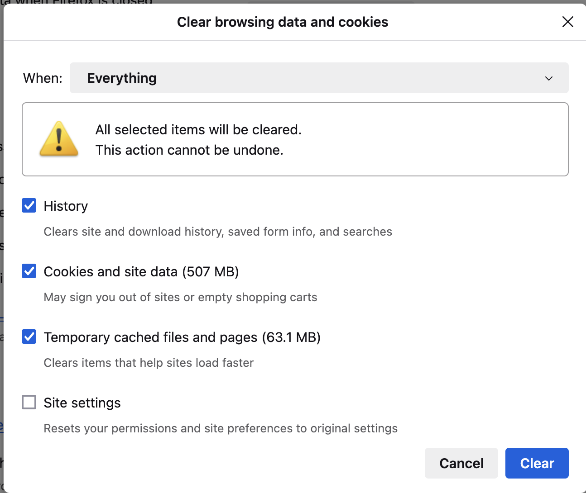

---
date:
    created: 2024-01-28
categories:
    - Tutorials
authors:
    - Kevin Pham
tags:
    - Browsers
    - Firefox
license: BY-SA
description: A beginner's guide to clearing browsing data - such as cookies, website cache, and browsing history, on Chrome, Firefox, and Safari.
schema_type: AnalysisNewsArticle
---
# How to Clear Your Browsing Data on Chrome, Firefox, and Safari

_Credit: Unsplashed_

Your browsing data — such as cache, cookies, and browsing history — can accumulate over time, potentially damaging your privacy. Whether you trying to free up storage, limit tracking, or protect yourself from digital forensics, clearing browsing data is an important first step on your privacy journey. In this guide, we will explain how to clear your browsing data on three popular web browsers: Chrome, Firefox, and Safari.

## Understanding Browsing Data

Cookies are small files that a website generates and sends to a browser. They associate browsing activity to a given user session, allowing people to visit websites without logging in repeatedly. Cookies also facilitate __personalization__, where websites "remember" your preferences and actions. Websites utilize personalization cookies to send targeted advertisements and track your location.

Website cache data refers to offline website data that your browser stores. By preloading content like webpages and images, subsequent visits to a website becomes faster. Unlike cookies, a cache does not expire and must be manually cleared. If you are concerned about digital forensics, consider clearing it.

Similarly, your browsing history must be deleted. As its name suggest, your web browser keeps a record of all visited websites offline. Your internet service provider could still view your history; however, you might want to prevent access from someone living with you.

## How to Clear Browsing Data

### Google Chrome

To start, ****launch**** Google Chrome. On the upper right-hand corner, click on the ****[placeholder three dots] icon**** to see a list of options. Then, click on ****Settings****

_Screenshot: Google Home Page_

You should see the following menu.

_Screenshot: Google Chrome Settings_

On the left, navigate to ****Privacy and Security****. You should see the following screen.

_Screenshot: Google Chrome Settings_

Click ****Delete browsing data.**** Here, you can check whether to clear your ****browsing history****, ****cookies****, and ****cached images & file****s. Chrome also allows you select the ****time range**** of the data marked for deletion.

_Screenshot: Google Chrome Settings_

After making any necessary changes, click ****Delete data****.

_Screenshot: Google Chrome Settings_

### Mozilla Firefox

Start by launching ****Firefox****. On the upper right-hand corner, click on the ****[placeholder three bars] icon**** to see a list of options. There, click on ****Settings****.

Screenshot: Privacy Guides Homepage

On the left, navigate to ****Privacy and Security****. You should see the following screen.

Screenshot: Firefox Settings

Scroll down to ****Cookies and Site Data****.

Screenshot: Firefox Settings

You have the option of either clearing your browsing data within a time range or in selected websites. Note that the latter deletes the website's cookies and cache, not history.

Screenshot: Firefox Settings

Click on ****Clear data**** if you prefer the former. Similarly to Google Chrome, you can chose what types of data to delete and its time range. After making your selection, click ****Clear**** to finalize the process.

### Apple Safari

Unlike Chrome and Firefox, Safari separates history settings from its privacy settings. For the purposes of this guide, we will delete browsing history first.

After opening Safari, move your cursor to the upper left-hand corner. Click ****History**** once the title bar appears.

Screenshot: Privacy Guides Homepage

If you want to clear browsing history in a specified time range, select ****Clear History**** at the bottom and follow the prompt. Otherwise, click ****Show All History****.

Screenshot: Safari Settings

In this menu, you can choose websites to delete from your history. Use the search bar to find the exact name of the website. You can also navigate to a specific data and time.

Screenshot: Safari Settings

Now, delete the cookies and cache data. Move your cursor to the title bar again and click ****Safari**** to see a drop down menu. Then, click ****Settings****.

Screenshot: Privacy Guides Homepage

Navigate to ****Privacy**** and click ****Manage Website Data...****

Screenshot: Safari Settings

You should see another menu with a list of websites and their corresponding browsing data types. As always, you can mark specified websites for deletion.

Screenshot: Safari Settings

Once you are done, click ****Remove****.
