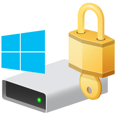

Encryption of data is the only way to control who can access it. If you are currently not using encryption software for your hard disk, emails, or files, you should pick an option here.

## Multi-platform

The options listed here are multi-platform and great for creating encrypted backups of your data.

### VeraCrypt

!!! recommendation

    { align=right }
    { align=right }

    **VeraCrypt** is a source-available freeware utility used for on-the-fly encryption. It can create a virtual encrypted disk within a file, encrypt a partition, or encrypt the entire storage device with pre-boot authentication.

    [Homepage](https://veracrypt.fr){ .md-button .md-button--primary }

    ??? downloads

        - [:fontawesome-brands-windows: Windows](https://www.veracrypt.fr/en/Downloads.html)
        - [:fontawesome-brands-apple: macOS](https://www.veracrypt.fr/en/Downloads.html)
        - [:fontawesome-brands-linux: Linux](https://www.veracrypt.fr/en/Downloads.html)
        - [:fontawesome-brands-git: Source](https://www.veracrypt.fr/code)

VeraCrypt is a fork of the discontinued TrueCrypt project. According to its developers, security improvements have been implemented and issues raised by the initial TrueCrypt code audit have been addressed.

When encrypting with VeraCrypt, you have the option to select from different [hash functions](https://en.wikipedia.org/wiki/VeraCrypt#Encryption_scheme). We suggest you **only** select [SHA-512](https://en.wikipedia.org/wiki/SHA-512) and stick to the [AES](https://en.wikipedia.org/wiki/Advanced_Encryption_Standard) block cipher.

Truecrypt has been [audited a number of times](https://en.wikipedia.org/wiki/TrueCrypt#Security_audits) and VeraCrypt has also been [audited seperately](https://en.wikipedia.org/wiki/VeraCrypt#VeraCrypt_audit).

### Cryptomator

!!! recommendation

    { align=right }

    **Cryptomator** is a cloud storage encryption solution designed to solve privacy issues when saving files to the cloud. It allows you to create vaults that are stored on a virtual drive, in which the contents of the vaults are encrypted and synced with a cloud storage provider.

    [Homepage](https://cryptomator.org){ .md-button .md-button--primary } [Privacy Policy](https://cryptomator.org/privacy){ .md-button }

    ??? downloads

        - [:fontawesome-brands-windows: Windows](https://cryptomator.org/downloads)
        - [:fontawesome-brands-apple: macOS](https://cryptomator.org/downloads)
        - [:fontawesome-brands-linux: Linux](https://cryptomator.org/downloads)
        - [:pg-flathub: Flatpak](https://flathub.org/apps/details/org.cryptomator.Cryptomator)
        - [:fontawesome-brands-google-play: Google Play](https://play.google.com/store/apps/details?id=org.cryptomator)
        - [:pg-f-droid: F-Droid](https://cryptomator.org/android)
        - [:fontawesome-brands-app-store-ios: App Store](https://apps.apple.com/us/app/cryptomator-2/id1560822163)
        - [:fontawesome-brands-github: Source](https://github.com/cryptomator)

Cryptomator utilizes the AES encryption standard with a 256 bit key length (AES-256) to encrypt both files and filenames. Cryptomator cannot encrypt access, modification, and creation timestamps nor the number and size of files and folders.

Some Cryptomator cryptographic libraries have been [audited](https://community.cryptomator.org/t/has-there-been-a-security-review-audit-of-cryptomator/44) by Cure53. The scope of the audited libraries include: [cryptolib](https://github.com/cryptomator/cryptolib), [cryptofs](https://github.com/cryptomator/cryptofs), [siv-mode](https://github.com/cryptomator/siv-mode) and [cryptomator-objc-cryptor](https://github.com/cryptomator/cryptomator-objc-cryptor). The audit did not extend to [cryptolib-swift](https://github.com/cryptomator/cryptolib-swift), which is a library used on Cryptomator for iOS.

For more information on Cryptomator and it’s security, visit their documented [security section](https://docs.cryptomator.org/en/latest/security/security-target/).

### Picocrypt

!!! recommendation

    { align=right }

    **Picocrypt** is a small and simple encryption tool that provides modern encryption. Picocrypt uses the secure XChaCha20 cipher and the Argon2id key derivation function to provide a high level of security. It uses Go's standard x/crypto modules for its encryption features.

    [Project Info](https://github.com/HACKERALERT/Picocrypt#readme){ .md-button .md-button--primary }

    ??? downloads

        - [:fontawesome-brands-windows: Windows](https://github.com/HACKERALERT/Picocrypt/releases)
        - [:fontawesome-brands-apple: macOS](https://github.com/HACKERALERT/Picocrypt/releases)
        - [:fontawesome-brands-linux: Linux](https://github.com/HACKERALERT/Picocrypt/releases)
        - [:fontawesome-brands-github: Source](https://github.com/HACKERALERT/Picocrypt)

## OS Full Disk Encryption

Modern operating systems include [FDE](https://en.wikipedia.org/wiki/Disk_encryption) and will utilize a [secure cryptoprocessor](https://en.wikipedia.org/wiki/Secure_cryptoprocessor).

### BitLocker

!!! recommendation

    { align=right }

    **BitLocker** is the full volume encryption solution bundled with Microsoft Windows. The main reason we recommend it is because of its [use of TPM](https://docs.microsoft.com/en-us/windows/security/information-protection/tpm/how-windows-uses-the-tpm). [ElcomSoft](https://en.wikipedia.org/wiki/ElcomSoft), a forensics company, has written about it in [Understanding BitLocker TPM Protection](https://blog.elcomsoft.com/2021/01/understanding-BitLocker-tpm-protection/).

    [Overview](https://docs.microsoft.com/en-us/windows/security/information-protection/BitLocker/BitLocker-overview){ .md-button .md-button--primary }

BitLocker is [only supported](https://support.microsoft.com/en-us/windows/turn-on-device-encryption-0c453637-bc88-5f74-5105-741561aae838) on Pro, Enterprise, and Education editions of Windows. It can be enabled on Home editions provided that they meet the prerequisites.

??? example "Enabling BitLocker on Windows Home"

    To enable BitLocker on "Home" editions of Windows, you must partitions formatted with formatted with a [GUID Partition Table](https://en.wikipedia.org/wiki/GUID_Partition_Table) and have a dedicated TPM (v1.2, 2.0+) module.

    1. Open Windows [PowerShell](https://en.wikipedia.org/wiki/PowerShell). Start "PowerShell"

    2. Check to see partition table format:
        ```
        powershell Get-Disk 0 | findstr GPT && echo This is a GPT system disk!
        ```

    3. Check TPM version. The value returned must be "3 True". The spec must be 1.2 or above.
        ```
        powershell Get-WmiObject -Namespace "root/cimv2/security/microsofttpm" -Class WIN32_tpm | findstr "IsActivated IsEnabled IsOwned SpecVersion"
        ```

    4. Access [Advanced Startup Options](https://support.microsoft.com/en-us/windows/advanced-startup-options-including-safe-mode-b90e7808-80b5-a291-d4b8-1a1af602b617). You need to reboot while pressing the F8 key before Windows starts and go into the *command prompt* in **Troubleshoot** → **Advanced Options** → **Command Prompt**.

    5. Login with your account that has admin privileges and type this to start encryption:
        ```
        manage-bde -on c: -used
        ```

    6. Close the command prompt, and enter into PowerShell:
    ```
    manage-bde c: -protectors -add -rp -tpm
    manage-bde -protectors -enable c:
    manage-bde -protectors -get c: > %UserProfile%\Desktop\BitLocker-Recovery-Key.txt
    ```

        !!! warning
            Backup `BitLocker-Recovery-Key.txt` on a separate storage device. Loss of this recovery code, may result in loss of data.

### FileVault

!!! recommendation

    { align=right }

    **FileVault** is the on-the-fly volume encryption solution built into macOS. FileVault is recommended because it [leverages](https://support.apple.com/guide/security/volume-encryption-with-filevault-sec4c6dc1b6e/web) hardware security capabilities present on an Apple silicon SoC or T2 Security Chip.

    [Article](https://support.apple.com/en-us/HT204837){ .md-button .md-button--primary }

We recommend storing a local recovery key in a secure place as opposed to utilizing iCloud FileVault recovery. As well, FileVault should be enabled **after** a complete macOS installation as more pseudorandom number generator ([PRNG](https://support.apple.com/guide/security/random-number-generation-seca0c73a75b/web)) [entropy](https://en.wikipedia.org/wiki/Entropy_(computing)) will be available.

### Linux Unified Key Setup

!!! recommendation

    { align=right }

    **LUKS** is the default FDE method for Linux. It can be used to encrypt full volumes, partitions, or create encrypted containers.

    [Project Wiki](https://gitlab.com/cryptsetup/cryptsetup/-/wikis/home){ .md-button .md-button--primary }

??? example "Creating and opening encrypted containers"

    ```
    dd if=/dev/urandom of=/path-to-file bs=1M count=1024 status=progress
    sudo cryptsetup luksFormat /path-to-file
    ```

    #### Opening encrypted containers
    We recommend opening containers and volumes with `udisksctl` as this uses [Polkit](https://en.wikipedia.org/wiki/Polkit). Most file managers, such as those included with popular desktop environments, can unlock encrypted files. Tools like [udiskie](https://github.com/coldfix/udiskie) can run in the system tray and provide a helpful user interface.
    ```
    udisksctl loop-setup -f /path-to-file
    udisksctl unlock -b /dev/loop0
    ```

!!! note "Remember to back up volume headers"

    We recommend you always [back up your LUKS headers](https://wiki.archlinux.org/title/Dm-crypt/Device_encryption#Backup_and_restore) in case of partial drive failure. This can be done with:

    ```
    cryptsetup luksHeaderBackup /dev/device --header-backup-file /mnt/backup/file.img
    ```

## Browser-based

Browser-based encryption can be useful when you need to encrypt a file but cannot install software or apps on your device.

### hat.sh

!!! recommendation

    { align=right }
    { align=right }

    **Hat.sh** is a web application that provides secure client-side file encryption in your browser. It can also be self-hosted and is useful if you need to encrypt a file but cannot install any software on your device due to organizational policies.

    [Homepage](https://hat.sh){ .md-button .md-button--primary }

    ??? downloads

        - [:fontawesome-brands-github: Source](https://github.com/sh-dv/hat.sh)

## Command-line

Tools with command-line interfaces are useful for intergrating [shell scripts](https://en.wikipedia.org/wiki/Shell_script).

### Kryptor

!!! recommendation

    { align=right }

    **Kryptor** is a free and open source file encryption and signing tool that makes use of modern and secure cryptographic algorithms. It aims to be a better version of [age](https://github.com/FiloSottile/age) and [Minisign](https://jedisct1.github.io/minisign/) to provide a simple, easier alternative to GPG.

    [Homepage](https://www.kryptor.co.uk){ .md-button .md-button--primary } [Privacy Policy](https://www.kryptor.co.uk/features#privacy){ .md-button }

    ??? downloads

        - [:fontawesome-brands-windows: Windows](https://www.kryptor.co.uk)
        - [:fontawesome-brands-apple: macOS](https://www.kryptor.co.uk)
        - [:fontawesome-brands-linux: Linux](https://www.kryptor.co.uk)
        - [:fontawesome-brands-github: Source](https://github.com/samuel-lucas6/Kryptor)

### Tomb

!!! recommendation

    { align=right }

    **Tomb** is an is a command-line shell wrapper for LUKS. It supports steganography via [third-party tools](https://github.com/dyne/Tomb#how-does-it-work).

    [Homepage](https://www.dyne.org/software/tomb){ .md-button .md-button--primary }

    ??? downloads

        - [:fontawesome-brands-github: Source](https://github.com/dyne/Tomb)

## OpenPGP

OpenPGP is sometimes needed for specific tasks such as digitally signing and encrypting email. PGP has many features and is [complex](https://latacora.micro.blog/2019/07/16/the-pgp-problem.html) as it has been around a long time. For tasks such as signing or encrypting files, we suggest the above options.

When encrypting with PGP, you have the option to configure different options in your `gpg.conf` file. We recommend staying with the standard options specified in the [GnuPG user FAQ](https://www.gnupg.org/faq/gnupg-faq.html#new_user_gpg_conf).

!!! tip "Use future defaults when generating a key"

    When [generating keys](https://www.gnupg.org/gph/en/manual/c14.html) we suggest using the `future-default` command as this will instruct GnuPG use modern cryptography such as [Curve25519](https://en.wikipedia.org/wiki/Curve25519#History) and [Ed25519](https://ed25519.cr.yp.to/):

    ```bash
    gpg --quick-gen-key alice@example.com future-default
    ```

### GNU Privacy Guard

!!! recommendation

    { align=right }

    **GnuPG** is a GPL-licensed alternative to the PGP suite of cryptographic software. GnuPG is compliant with [RFC 4880](https://tools.ietf.org/html/rfc4880), which is the current IETF specification of OpenPGP. The GnuPG project has been working on an [updated draft](https://datatracker.ietf.org/doc/draft-ietf-openpgp-crypto-refresh/) in an attempt to modernize OpenPGP. GnuPG is a part of the Free Software Foundation's GNU software project and has received major [funding](https://gnupg.org/blog/20220102-a-new-future-for-gnupg.html) from the German government.

    [Homepage](https://gnupg.org){ .md-button .md-button--primary } [Privacy Policy](https://gnupg.org/privacy-policy.html){ .md-button }

    ??? downloads

        - [:fontawesome-brands-windows: Windows](https://gpg4win.org/download.html)
        - [:fontawesome-brands-apple: macOS](https://gpgtools.org)
        - [:fontawesome-brands-linux: Linux](https://gnupg.org/download/index.html#binary)
        - [:fontawesome-brands-google-play: Google Play](https://play.google.com/store/apps/details?id=org.sufficientlysecure.keychain)
        - [:fontawesome-brands-git: Source](https://git.gnupg.org/cgi-bin/gitweb.cgi?p=gnupg.git)

### GPG4win

!!! recommendation

    { align=right }

    **GPG4win** is a package for Windows from [Intevation and g10 Code](https://gpg4win.org/impressum.html). It includes [various tools](https://gpg4win.org/about.html) that can assist you in using GPG on Microsoft Windows. The project was initiated and originally [funded by](https://web.archive.org/web/20190425125223/https://joinup.ec.europa.eu/news/government-used-cryptography) Germany's Federal Office for Information Security (BSI) in 2005.

    [Homepage](https://gpg4win.org){ .md-button .md-button--primary } [Privacy Policy](https://gpg4win.org/privacy-policy.html){ .md-button }

    ??? downloads

        - [:fontawesome-brands-windows: Windows](https://gpg4win.org/download.html)
        - [:fontawesome-brands-git: Source](https://git.gnupg.org/cgi-bin/gitweb.cgi?p=gpg4win.git;a=summary)

### GPG Suite

!!! note

    We suggest [Canary Mail](email-clients.md#canary-mail) for using PGP with email on iOS devices.

!!! recommendation

    { align=right }

    **GPG Suite** provides OpenPGP support for [Apple Mail](email-clients.md#apple-mail) and macOS. GPG Mail costs $24€ yearly for their support plan and includes a 30-day trial. For more details see the [FAQ](https://gpgtools.org/faq).

    We recommend taking a look at their [First steps](https://gpgtools.tenderapp.com/kb/how-to/first-steps-where-do-i-start-where-do-i-begin-setup-gpgtools-create-a-new-key-your-first-encrypted-email) and [Knowledge base](https://gpgtools.tenderapp.com/kb) for support.

    [Homepage](https://gpgtools.org){ .md-button .md-button--primary } [Privacy Policy](https://gpgtools.org/privacy){ .md-button }

    ??? downloads

        - [:fontawesome-brands-apple: macOS](https://gpgtools.org)
        - [:fontawesome-brands-git: Source](https://github.com/GPGTools)

### OpenKeychain

!!! recommendation

    { align=right }

    **OpenKeychain** is an Android implementation of GnuPG. It's commonly required by mail clients such as [K-9 Mail](email-clients.md#k-9-mail) and [FairEmail](email-clients.md#fairemail) and other Android apps to provide encryption support. Cure53 completed a [security audit](https://www.openkeychain.org/openkeychain-3-6) of OpenKeychain 3.6 in October 2015. Technical details about the audit and OpenKeychain's solutions can be found [here](https://github.com/open-keychain/open-keychain/wiki/cure53-Security-Audit-2015).

    [Homepage](https://www.openkeychain.org){ .md-button .md-button--primary } [Privacy Policy](https://www.openkeychain.org/help/privacy-policy){ .md-button }

    ??? downloads

        - [:fontawesome-brands-google-play: Google Play](https://play.google.com/store/apps/details?id=org.sufficientlysecure.keychain)
        - [:pg-f-droid: F-Droid](https://f-droid.org/packages/org.sufficientlysecure.keychain/)
        - [:fontawesome-brands-git: Source](https://github.com/open-keychain/open-keychain)

--8<-- "includes/abbreviations.en.md"
