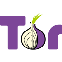

These networks are designed to keep your traffic anonymous.

## Tor

!!! recommendation

    { align=right }

    The **Tor** network is a group of volunteer-operated servers that allows people to improve their privacy and security on the Internet. You use the Tor network by connecting through a series of virtual tunnels rather than making a direct connection to the site you're trying to visit, thus allowing both organizations and individuals to share information over public networks without compromising their privacy. Tor is an effective censorship circumvention tool.

    [:octicons-home-16: Homepage](https://www.torproject.org){ .md-button .md-button--primary }
    [:pg-tor:](http://2gzyxa5ihm7nsggfxnu52rck2vv4rvmdlkiu3zzui5du4xyclen53wid.onion){ .card-link title=Onion }
    [:octicons-info-16:](https://tb-manual.torproject.org/){ .card-link title=Documentation}
    [:octicons-code-16:](https://gitweb.torproject.org/tor.git){ .card-link title="Source Code" }
    [:octicons-heart-16:](https://donate.torproject.org/){ .card-link title=Contribute }

    ??? downloads

        [:fontawesome-brands-windows:](https://www.torproject.org/download/){ .card-link title=Windows }
        [:fontawesome-brands-apple:](https://www.torproject.org/download/){ .card-link title=macOS }
        [:fontawesome-brands-linux:](https://www.torproject.org/download/){ .card-link title=Linux }
        [:fontawesome-brands-freebsd:](https://www.freshports.org/security/tor){ .card-link title=FreeBSD }
        [:pg-openbsd:](https://openports.se/net/tor){ .card-link title=OpenBSD }
        [:pg-netbsd:](https://pkgsrc.se/net/tor){ .card-link title=NetBSD }
        [:fontawesome-brands-google-play:](https://play.google.com/store/apps/details?id=org.torproject.torbrowser){ .card-link title="Google Play" }
        [:pg-f-droid:](https://support.torproject.org/tormobile/tormobile-7/){ .card-link title=F-Droid }
        [:fontawesome-brands-android:](https://www.torproject.org/download/#android){ .card-link title=Android }

## Invisible Internet Project

!!! recommendation

    { align=right }
    { align=right }

    **I2P** is a computer network layer that allows applications to send messages to each other pseudonymously and securely. Uses include anonymous Web surfing, chatting, blogging, and file transfers. The software that implements this layer is called an I2P router and a computer running I2P is called an I2P node. The software is free and open-source and is published under multiple licenses.

    [:octicons-home-16: Homepage](https://geti2p.net){ .md-button .md-button--primary }
    [:octicons-info-16:](https://geti2p.net/en/faq){ .card-link title=Documentation}
    [:octicons-code-16:](https://geti2p.net/en/get-involved/guides/new-developers#getting-the-i2p-code){ .card-link title="Source Code" }
    [:octicons-heart-16:](https://geti2p.net/en/get-involved){ .card-link title=Contribute }

    ??? downloads

        [:fontawesome-brands-windows:](https://geti2p.net/en/download#windows){ .card-link title=Windows }
        [:fontawesome-brands-apple:](https://geti2p.net/en/download#mac){ .card-link title=macOS }
        [:fontawesome-brands-linux:](https://geti2p.net/en/download#unix){ .card-link title=Linux }
        [:fontawesome-brands-freebsd:](https://www.freshports.org/security/i2p){ .card-link title=FreeBSD }
        [:pg-openbsd:](https://openports.se/net/i2pd){ .card-link title=OpenBSD }
        [:pg-netbsd:](https://pkgsrc.se/wip/i2pd){ .card-link title=NetBSD }
        [:fontawesome-brands-android:](https://geti2p.net/en/download#android){ .card-link title=Android }
        [:fontawesome-brands-google-play:](https://play.google.com/store/apps/details?id=net.i2p.android){ .card-link title="Google Play" }
        [:pg-f-droid:](https://f-droid.org/app/net.i2p.android.router){ .card-link title=F-Droid }

## The Freenet Project

!!! recommendation

    { align=right }

    **Freenet** is a peer-to-peer platform for censorship-resistant communication. It uses a decentralized distributed data store to keep and deliver information, and has a suite of free software for publishing and communicating on the Web without fear of censorship. Both Freenet and some of its associated tools were originally designed by Ian Clarke, who defined Freenet's goal as providing freedom of speech on the Internet with strong anonymity protection.

    [:octicons-home-16: Homepage](https://freenetproject.org){ .md-button .md-button--primary }
    [:octicons-info-16:](https://freenetproject.org/pages/documentation.html){ .card-link title=Documentation}
    [:octicons-code-16:](https://github.com/freenet/){ .card-link title="Source Code" }
    [:octicons-heart-16:](https://freenetproject.org/pages/donate.html){ .card-link title=Contribute }

    ??? downloads

        [:fontawesome-brands-windows:](https://freenetproject.org/pages/download.html#windows){ .card-link title=Windows }
        [:fontawesome-brands-apple:](https://freenetproject.org/pages/download.html#os-x){ .card-link title=macOS }
        [:fontawesome-brands-linux:](https://freenetproject.org/pages/download.html#gnulinux-posix){ .card-link title=Linux }
        [:fontawesome-brands-freebsd:](https://freenetproject.org/pages/download.html#gnulinux-posix){ .card-link title=FreeBSD }
        [:pg-openbsd:](https://freenetproject.org/pages/download.html#gnulinux-posix){ .card-link title=OpenBSD }
        [:pg-netbsd:](https://freenetproject.org/pages/download.html#gnulinux-posix){ .card-link title=NetBSD }

--8<-- "includes/abbreviations.en.md"
